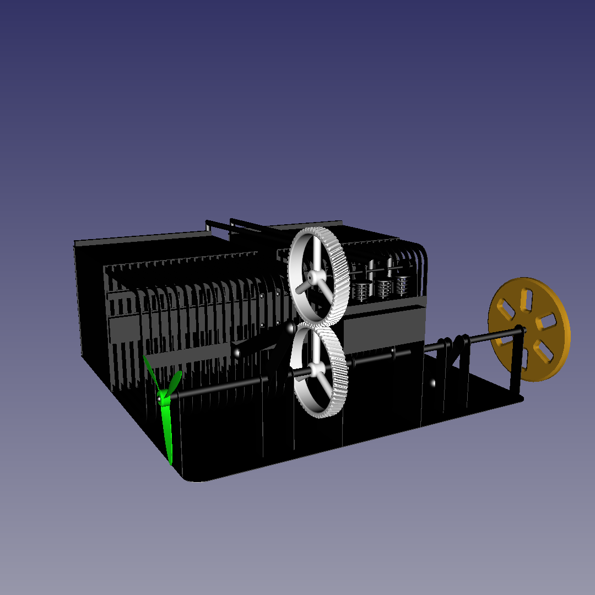

<!--
(C) 2024 Серый MLGamer. All freedoms preserved.
Дзен: <https://dzen.ru/seriy_mlgamer>
SoundCloud: <https://soundcloud.com/seriy_mlgamer>
YouTube: <https://www.youtube.com/@Seriy_MLGamer>
GitHub: <https://github.com/Seriy-MLGamer>
E-mail: <Seriy-MLGamer@yandex.ru>

This file is free documentation: you can redistribute it and/or modify it under the terms of the Creative Commons Attribution-ShareAlike 4.0 International license: <https://creativecommons.org/licenses/by-sa/4.0/>.
This file is distributed in the hope that it will be useful, but WITHOUT ANY WARRANTY; without even the implied warranty of MERCHANTABILITY or FITNESS FOR A PARTICULAR PURPOSE. See the license for more details.
-->

# "Delta" Stirling engine

An innovative Stirling engine of revised design with increased specific power.

## Relevance

Modern car and powerplant engines, solar panels have not so much efficiency. Therefore engines affect ecology quite seriously, solar panels produce less energy than they could. Cars' ICEs are restricted in energy sources by their design. Modern Stirling engines have high efficiency only at low powers relative to their masses, so they can't solve problems stated above.

## This model specification

  * Power: >1 kW.
  * Efficiency: ~40%.
  * Working fluid: air at atmospheric pressure.
  * Size: <30 cm.
  * Main material: stainless steel.

*Specifications are not accurate at the moment and may change significantly during tests.*

## Design features

Slow heat exchange problem has been solved by invention of the thin heat exchanger (inner thickness is 0.5 mm) with sealed displacement piston. 20 heat exchangers are combined into a radiator to increase area, which means power.

*Two*, hot and cold, heat exchangers are funtional from *both* sides, i. e. these *two* sides are connected to *two* working cylinders and to each other by *two* regenerators. That ensures full load of heat exchangers.

*By the way, I want to draw your attention to my article about previous Stirling engine model of similar design at [Дзен](https://dzen.ru/a/Ywe-duoiYVKAe5At?share_to=link).*

## License

Delta Stirling is free work: you can redistribute it and/or modify it under the terms of the GNU General Public License as published by the Free Software Foundation, either version 3 of the License, or (at your option) any later version.

Delta Stirling is distributed in the hope that it will be useful, but WITHOUT ANY WARRANTY; without even the implied warranty of MERCHANTABILITY or FITNESS FOR A PARTICULAR PURPOSE. See the GNU General Public License for more details.

You should have received a copy of the GNU General Public License along with Delta Stirling. If not, see <https://www.gnu.org/licenses/>.

# Project progress

Now it's needed to prepare design and technological documentation for the following prototype manufacturing.

At this moment you are able to study this model design from "src/model.FCStd" 3D-model made using [FreeCAD](https://freecad.org) 0.20.2.

You are welcome with material and professional support of this project.

## Material support

  * [DonationAlerts](https://donationalerts.com/r/seriy_mlgamer)
  * [donate*stream](https://donate.stream/seriy_mlgamer)
  * [Boosty](https://boosty.to/seriy_mlgamer)

## Professional support

I need qualified engineers support in design, bugs catching, calculations and so on.

This project is published at [GitHub](https://github.com/Seriy-MLGamer/Delta_Stirling). Share your ideas and report bugs at [Issues](https://github.com/Seriy-MLGamer/Delta_Stirling/issues). Suggest your changes at [Pull requests](https://github.com/Seriy-MLGamer/Delta_Stirling/pulls).