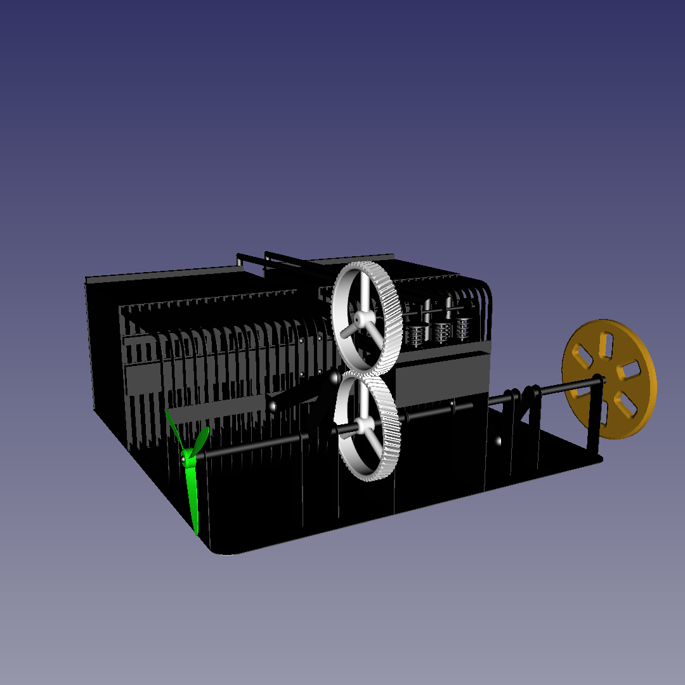

<!--
(C) 2024 Серый MLGamer. Все свободы предоставлены.
Дзен: <https://dzen.ru/seriy_mlgamer>
SoundCloud: <https://soundcloud.com/seriy_mlgamer>
YouTube: <https://www.youtube.com/@Seriy_MLGamer>
GitHub: <https://github.com/Seriy-MLGamer>
E-mail: <Seriy-MLGamer@yandex.ru>

Этот файл - свободная документация: вы можете перераспространять его и/или изменять его на условиях лицензии Creative Commons Атрибуция-СохранениеУсловий 4.0 Всемирной: <https://creativecommons.org/licenses/by-sa/4.0/deed.ru>.
Этот файл распространяется в надежде, что он будет полезен, но БЕЗО ВСЯКИХ ГАРАНТИЙ; даже без неявной гарантии ТОВАРНОГО ВИДА или ПРИГОДНОСТИ ДЛЯ ОПРЕДЕЛЁННЫХ ЦЕЛЕЙ. Подробнее смотрите в лицензии.
-->

# Двигатель Стирлинга &laquo;Дельта&raquo;

Инновационный двигатель Стирлинга c переработанной конструкцией и повышенной удельной мощностью.

## Актуальность

Современные двигатели для автомобилей и электростанций, а также солнечные батареи обладают не очень большим КПД, из-за чего двигатели оказывают достаточно серьёзное экологическое влияние, а солнечные батареи вырабатывают меньше электроэнергии, чем могли бы. Автомобильные ДВС в силу конструктивных особенностей ограничены в выборе источников энергии. Современные двигатели Стирлинга обладают большим КПД лишь на небольших мощностях относительно своих массы и размера, поэтому не способны решить вышеперечисленные проблемы.

## Характеристики данной модели

  * Мощность: ~600 Вт.
  * КПД: ~50%.
  * Рабочее тело: воздух атмосферного давления.
  * Габариты: <30 см.
  * Основной материал: нержавеющая сталь.

*Параметры пока являются приблизительными и могут сильно измениться в ходе испытаний.*

## Особенности конструкции

Решена проблема медленного теплообмена с воздухом путём изобретения тонкого теплообменника (внутренняя толщина 0,5 мм) с герметичным вытеснительным поршнем. Для увеличения площади, а значит мощности, такие теплообменники объединены в радиатор из 20 штук.

*Два* теплообменника: горячий и холодный &mdash; являются функциональными с *двух* сторон, то есть с *двух* сторон подключены к *двум* рабочим цилиндрам и соединены *двумя* регенераторами. Это обеспечивает полное задействование теплообменников.

Подробное описание этого двигателя смотрите в статье &laquo;Двигатель Стирлинга &laquo;Дельта&raquo;: обзорная статья&raquo;, доступной на [Дзене](https://dzen.ru/a/ZjI1lzHqzjpZLhe3?share_to=link) и в [этом репозитории](Двигатель%20Стирлинга%20&laquo;Дельта&raquo;:%20обзорная%20статья.md).

*Кстати, хочу обратить ваше внимание на мою статью о предыдущей модели двигателя Стирлинга подобной конструкции на [Дзене](https://dzen.ru/a/Ywe-duoiYVKAe5At?share_to=link).*

## Лицензия

Проект двигателя Стирлинга &laquo;Дельта&raquo; &mdash; свободное произведение: вы можете перераспространять его и/или изменять его на условиях [Стандартной общественной лицензии GNU](COPYING.md) в том виде, в каком она была опубликована Фондом свободного программного обеспечения; либо версии 3 лицензии, либо (по вашему выбору) любой более поздней версии.

Проект распространяется в надежде, что он будет полезен, но БЕЗО ВСЯКИХ ГАРАНТИЙ; даже без неявной гарантии ТОВАРНОГО ВИДА или ПРИГОДНОСТИ ДЛЯ ОПРЕДЕЛЕННЫХ ЦЕЛЕЙ. Подробнее см. в Стандартной общественной лицензии GNU.

Вы должны были получить копию Стандартной общественной лицензии GNU вместе с этим произведением. Если это не так, см. <https://www.gnu.org/licenses/>.

# Развитие проекта

Необходимая конструкторская документация разработана. Технологическая... Без неё справлюсь. Всё готово к непостредственному производству деталей и их сборке в единый двигатель Стирлинга.

У вас есть возможность изучить строение двигателя по 3D-модели &laquo;src/model.FCStd&raquo;, сделанной в САПР [FreeCAD](https://freecad.org) 0.20.2.

Также в папке &laquo;bin&raquo; есть чертежи в форматах PDF и SVG, схема для лазерного станка &laquo;metal scheme.dxf&raquo;, модели для станков с ЧПУ и 3D-принтеров в формате STEP.

Буду рад вашей материальной и профессиональной помощи этому проекту.

### Материальная помощь

Проект находится на финишной прямой! Теперь нужно просто много денег на материалы и оборудование, и двигатель будет готов.

  * [DonationAlerts](https://donationalerts.com/r/seriy_mlgamer)
  * [donate*stream](https://donate.stream/seriy_mlgamer)
  * [Boosty](https://boosty.to/seriy_mlgamer)

### Профессиональная помощь

Желательна помощь профессиональных инженеров в проектировании, поиске недочётов, расчётах и т. д.

Этот проект доступен на платформе [GitHub](https://github.com/Seriy-MLGamer/Delta_Stirling). Предлагайте идеи и сообщайте об ошибках в разделе &laquo;[Проблемы](https://github.com/Seriy-MLGamer/Delta_Stirling/issues)&raquo;, а изменения предлагайте в разделе &laquo;[Запросы на вытягивание](https://github.com/Seriy-MLGamer/Delta_Stirling/pulls)&raquo;.